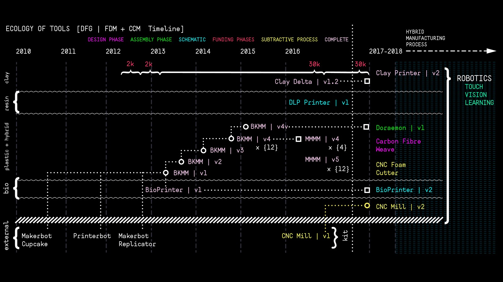

## 3d Printing / Machine Design // Clay & Large Format
---

When confronted with a situation where there are no tools to do the things that we do, we need to create our own.

The research that we conduct has always been seen as a form of digital craft―the relationship between the two has become ever more important with respect to how we think about the production of the built environment, the artifacts that surround us, and everyday items held in our hands. It has led us down a series of exciting paths, but the one at the forefront is the development of low-cost, open source, desktop manufacturing platforms. What started out as a project to build robots and 3d printers have grown into a manifesto on emancipation through tools. 

This experience has changed the way we think about material and the way we understand making. The act of creating one’s own tools and instruments is about building new ways to engage and construct worlds.

We are increasingly asking remarkably and ever more complex tools to perceive, interpret, and act upon the world in our stead― not so much because we lack the energy or the determination, but because the problems created by our modern lives have outstripped our means for resolving them. Pratt's history of making as well as

the way we have have been educating our students have helped to position us favorably to not only meet this task but to lead others on how to negotiate the flow of information between analog and digital worlds.

The following has to do with a new way to think about tools in the institute.

Ecology of Tools/Machines/Instruments

The powers of 10 nest and they all need each other:

- #### $1,000,000 machines - used for research

- #### $100,000 machines - to create machines

- #### $10,000 machines - make projects

- #### $1,000 machines - support (research, machines, and projects)

Map of tool development and its evolution through its connections between multiple platforms (biological material, plastic, hybrids, clay feedstock). In our case, it is now migrating towards interdisciplinary collaborative robotics and we can push things further we are because we are positioned in the IT division. 

