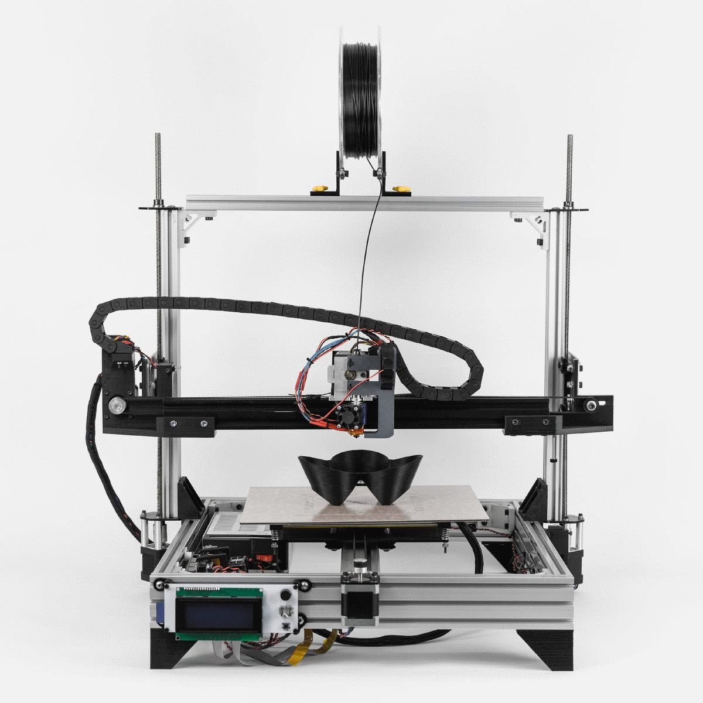
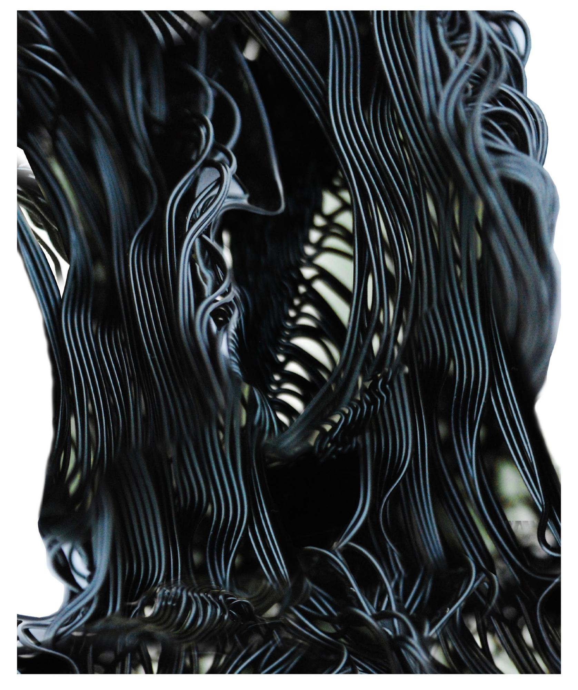

## 3d Printing / Machine Design // Clay & Large Format
---

When confronted with a situation where there are no tools to do the things that we do, we need to create our own.

The research that we conduct has always been seen as a form of digital craft―the relationship between the two has become ever more important with respect to how we think about the production of the built environment, the artifacts that surround us, and everyday items held in our hands. It has led us down a series of exciting paths, but the one at the forefront is the development of low-cost, open source, desktop manufacturing platforms. What started out as a project to build robots and 3d printers have grown into a manifesto on emancipation through tools. 

This experience has changed the way we think about material and the way we understand making. The act of creating one’s own tools and instruments is about building new ways to engage and construct worlds.

We are increasingly asking remarkably and ever more complex tools to perceive, interpret, and act upon the world in our stead― not so much because we lack the energy or the determination, but because the problems created by our modern lives have outstripped our means for resolving them. Pratt's history of making as well as

the way we have have been educating our students have helped to position us favorably to not only meet this task but to lead others on how to negotiate the flow of information between analog and digital worlds.

The following has to do with a new way to think about tools in the institute.

| Price Point |  $1,000,000 | $100,000           | $10,000             |   $1,000  |
| Function    |  Research  | Machine Fabrication | Project Fabrication |  Support  |

> Ecology of Tools/Machines/Instruments. The powers of 10 nest and they all need each other.

> Map of tool development and its evolution through its connections between multiple platforms (biological material, plastic, hybrids, clay feedstock). In our case, it is now migrating towards interdisciplinary collaborative robotics and we can push things further we are because we are positioned in the IT division. 

  

  
  

  

  
  

 

> Plastic printing BKMM (left) and Clay extruding delta robot (right)

---

## Large Scale Extruders

> Prototype for large scale pellet extrusion.

---

## Extrusion Spans

> _Blurred Lines_ - Degree Project Research by Andrew Reitz & Matt Leta

> _Blurred Lines_ - Degree Project Research by Andrew Reitz & Matt Leta

> Diagram 3: Controlling Where the Uncontrollable Occurs - What seems like chaos is actually ordered. Where Catenaries occurs, bundling emerges within. Where plateaus occur, rippling emerges. When Catenaries are being formed, plateaus begin to emerge along the perimeters of the beginning and end of the catenaries. Between these two hierarchies, there is chaos or what is actually a lattice formation that stitches the two separate categories of worlds together. Diagram 5: Speed of Extrusion - the faster the strands are deposited, the less likely a catenaries form.

> Phase 2: Line to Volume / Proof 1: Phase 2 marked the beginning of control. This catalog depicts ten identical models, each exhibiting the subtle variations that occur in the process as a result of external factors such as a subtle change in temperature or a slight increase in air flow.

> _Blurred Lines_ - Degree Project Research by Andrew Reitz & Matt Leta

> Diagram 1: Process of the digital input to physical output. Diagram 2: Density - There is a threshold between what is expected and what is not. For instance, if 60 strands are digitally inputted across a width of 2 inches, the results are straight slumped fibers. If the digital input is 70, the result is a material computation, which is a series of self-organizing intricately affecting segments of each other fiber in a neighboring condition that ultimately affects the whole. Diagram 4: Pattern of Extrusions. This diagram indicates the results of what occurs when a strand or two is culled from the system.

> Phase 3: Emergent Repetition - Phase 3 marked the beginning of an actual loss of fidelity. This catalog documents ten models, each with the same digital input and a variety of different physical outputs. All models exhibit similar qualities. Where the catenaries occur, bundling takes effect. Where the plateaus emerge, ripples form. We began to extrapolate architectural values based on conditions of visibility and sound absorption.

> Phase 3: Emergent Repetition - This photograph exhibits the intricate “ripples" that emerge during the fabrication/3d printing process. The uncontrollability of these effects met with controllability of the digital input, directed the research into a new phase that is deemed "the modulation”

---

## Bioprinter

 > Bioprinter: David Ruy, BioPrinter design: Richard Sarrach, Synthetic Biologists: Oliver Medvedik and Nina Tandon 

 

 > Bioprinter: David Ruy, BioPrinter design: Richard Sarrach, Synthetic Biologists: Oliver Medvedik and Nina Tandon 

 ---

 ## Cupcake: Frankenbot

---

