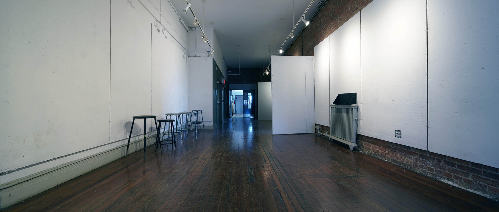
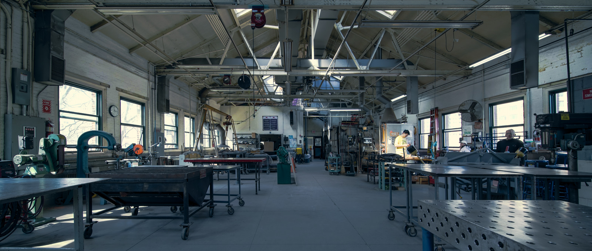

## Autonomous Environmental Enclosures // Escape Pod

---

Contemporary work environments are all too often unable to keep up with the constantly shifting demands of its users. Evolving workplace culture, behaviors and desires, as well as the rise in diverse collaborative project management, have placed undue strain on the physical constraints of interior spatial and furniture design. Beholden to arcs of financial and temporal pressures, addressing these evolving needs often manifest in makeshift solutions that underwhelm and underperform opposed to comprehensive renovations required. 

Responding to these pressures, at the disjunct between workplace space-planning and dynamic use, the ‘Escape Pod’ provides a refuge, accommodating flexibility at both the spatial and furniture scale. The holistic approach towards the ‘Escape Pod’ tempers both use and performance in addition to pragmatics providing a sub-space within an existing environment.

<iframe width="100%" height="600" src="https://sketchfab.com/models/bc9895e366c448509a48c50ea68586e8/embed" frameborder="0" allow="autoplay; fullscreen; vr" mozallowfullscreen="true" webkitallowfullscreen="true"></iframe>

This flat-pack, easy to assemble system allows for deployment within various interior environments, providing an acoustical ‘bubble’ with customizable interior workspace for one or two occupants.

The interior configuration, composed of a tabletop, chairs and pin-up surface, is sized appropriately to accommodate one to two individuals. Depending on occupancy or needs of users, the interior is customizable via a calibrated oversized peg-wall system that allows for adjustments of size and space of the interior environment.

Comfort and temporal solitude is/are provided by the escape pods carefully selected materials, embedded systems, and unique layered construction. Providing not only a durable and aesthetically pleasing interior, but an acoustical shell allowing for privacy and separation from external surroundings. 

Adjustable lighting and constant ventilation, achieved without compromising acoustical performance, allows for tailoring of the interior environment for users desired needs and comfort.

Pragmatically, the escape pod by design is deployable in a multitude of spaces given its flat-pack shipment and ease of assembly. This allows unskilled labor to efficiently deliver, move and configure the pod using the door and standard elevator bay as a design constraint. Simple mechanical connections with limited tools and drop in material layers are designed for ease of construction by a limited number of individuals. 

The resulting ‘escape pods’ can be a stand-alone addition to a work environment or configured in a handful of organizations from bays to linked connection producing larger spaces. Once assembled, added flexibility with industrial casters truly supports the promise of adaptable microenvironments design.

Altogether the escape pods comprehensive approach provides the ideal design solution at the mesoscale for evolving work environments. It’s innovation, performance, and durability addresses the immediate issues of workplace settings while negotiating an array of constraints and pragmatics.

---

## Acoustical Material Testing

In accounting for acoustical properties of building materials, a single number Noise Reduction Coefficient (NRC) or Sound Transmission Class (STC) value is used by the industry as standard metric. Both value systems describe how well a material absorbs sound energy. While NRC focuses on the reflected sound, STC focuses on the transmitted sound, usually in the range of normal speech frequencies between 120 Hz to 4000 Hz [^1]

[^1]: http://www.montana.edu/rmaher/eele417_fl14/Determination_of_STC.pdf

While NRC and STC are industry standards in understanding acoustical properties of building materials, in an age where offices have mostly adopted an open office layout where sound transmits freely, and with diversifying office culture where activities like desktop prototyping with CNC machines, doggy day care, and aerobic exercises can happen in the same space, these metrics are no longer adequate in assessing our aural environments.  

According to the National Institute on Deafness and Other Communication Disorders, long term exposure to sounds at or above 85 decibels can cause hearing loss [^2].  This metric to correlate sound pressure levels to hearing loss is, however, much too simplistic because it does not describe how different frequencies of sound affects our health differently. In a paper published in Environmental Health in 2014, researchers found high exposure to low frequency traffic noise at around 125 Hz may induce hypertension [^3].  Other researchers have also found significant associations between low frequency exposure to chronic diseases such as headaches, unusual tiredness, lack of concentration, irritation, and pressure on the eardrum [^4].  

[^2]: https://www.nidcd.nih.gov/health/noise-induced-hearing-loss
[^3]: Chang, Ta-Yuan et al. “Road traffic noise frequency and prevalent hypertension in Taichung, Taiwan: a cross-sectional study” Environmental health : a global access science source vol. 13,1 37. 16 May. 2014, doi:10.1186/1476-069X-13-37
[^4]: Persson Waye, Kerstin. (2011). Noise and Health - Effects of Low Frequency Noise and Vibrations: Environmental and Occupational Perspectives. 10.1016/B978-0-444-52272-6.00245-2.

In short, our evolving work environment and the increasing number of environmental health research are showing a deficiency in this single value system, and our proposal is to develop a more comprehensive view of noise and its interaction with space and materials. 

What we propose is to go beyond the single value metric. Sound is a spectrum and human hearing is sensitive from 20Hz to 20kHz, therefore, we propose an acoustical standard that would allow us to gain a deeper insight into the nature of sound. 

This proposal involve 2 stages of acoustical testing. The first is to record and graph environmental noise in and around our work environments. We want to record and profile noises of common equipments and how it differs from “background” noise.  For the second phase, we will build an acoustical testing station to test and profile common and unusual acoustical materials. 

------

## Material Testing Methodology

Rather than doing a standardized test at 1/3rd octave frequencies between 100Hz to 4000Hz, we decided to do a full spectrum sweep between 20Hz to 20,000Hz. For equipment we are using a measurement microphone that is factory calibrated and records a flat profile. We setup a rig so the speaker and microphone is 1 meter apart, and the testing material is right up against the speaker to minimize reflected sound. We take a control measurement without any materials prior to each test. Measurement is then collected and processed with Python.

<iframe width="100%" height="400" frameborder="0" scrolling="no" src="//plot.ly/~prattitl/166.embed"></iframe>

<iframe width="100%" height="400" frameborder="0" scrolling="no" src="//plot.ly/~prattitl/156.embed"></iframe>

<iframe width="100%" height="400" frameborder="0" scrolling="no" src="//plot.ly/~prattitl/158.embed"></iframe>

<iframe width="100%" height="400" frameborder="0" scrolling="no" src="//plot.ly/~prattitl/160.embed"></iframe>

<iframe width="100%" height="400" frameborder="0" scrolling="no" src="//plot.ly/~prattitl/162.embed"></iframe>

<iframe width="100%" height="400" frameborder="0" scrolling="no" src="//plot.ly/~prattitl/164.embed"></iframe>

------

## Our Measurements

#### Environmental Noise Recording Methodology

For sound recording, we are using a Zoom H1 Digital Recorder with 2 unidirectional microphone set at 90 degree to one another recording a wide sound field, and an Extech 407730- Digital sound level meter to record the sound pressure level (SPL) of the source, typically 1 meter away or as noted. If situation does not allow for the recording to be at 1 meter away, 2 meter distance is used and we use the Inverse Square Law, reduction of 6 decibel per meter, to adjust for the final value. 

### *dL  =  20 log (R2 / R1)*  

*where:*

*dL = difference in sound pressure level (dB)*

*R1 = distance from source to location 1 (ft, m)*

*R2 = distance from source to location 2 (ft, m)*

The sound pressure level is recorded with A-weighting on the instrument, which is weighted to human sound perception. The initial recordings recorded at about 36 locations profiling various kinds of noise, from single point source produced by a single machine, an omnisource produced by the extraction fan that is omnipresent, to background noise produced by foot and vehicular traffic. 

We also referenced Health Link British Columbia [^5] for typical noise types and their average decibels levels, and we established that around 50 dB is what a quiet work environment would be, high 70s dB can be irritating to people, and above 85 dB would be considered harmful if there is long term exposure. 

[^5]: https://www.healthlinkbc.ca/health-topics/tf4173

Based on this information, we collated our recordings and profiled spaces that can serve as our baseline for what a quiet work environment would be, and spaces with frequent noise level above 75 dB. 

| LOCATION                              | SOUND SOURCE       | DISTANCE FROM SOURCE | SOUND LEVEL |
| ------------------------------------- | ------------------ | -------------------- | ----------- |
| ITL Office                            | 3D Printer         | 1 m                  | 50.5        |
| ITL Office                            | Chop Saw           | 2 m                  | 101.1       |
| Higgins Hall Lobby                    | Foot Traffic       | ambient              | 81.8        |
| Higgins Hall Main Staircase 1st Floor | Vending Machine    | 1 m                  | 77.6        |
| Higgins Hall CNC Shop                 | CNC                | 2 m                  | 107.8       |
| Higgins Hall South 3rd Floor Hallway  | CNC + Foot Traffic | 1 m                  | 79.3        |
| Higgins Hall 3D Print Shop            | Spray Booth Fan    | 1 m                  | 81          |
| Main Campus Security Booth            | Ambient Traffic    | ambient              | 75.1        |
| Pratt Career Center                   | Foot Traffic       | ambient              | 53          |
| Cafeteria                             | Foot Traffic       | ambient              | 79.3        |
| Engineering Wood Shop                 | Machinery          | 1 m                  | 79.5        |
| Engineering Print Lab                 | Printers           | 1 m                  | 77          |
| Engineering 1st Floor Hallway         | Video              | 2 m                  | 77.6        |

------

## Data Processing Protocol

In addition to recording the sound pressure levels,  the sound is also recorded as a sound file in .WAV 24bit / 96kHz format. The .WAV file is then brought into Audacity where we use its Fast Fourier Transform (FFT) algorithm to plot the spectrum. However, since Audacity’s spectral-graph is not weighted to human hearing, the data is exported out as a text file and then brought into Python to apply A-weighting with the following equation.

##### A-Weighting Equation [^6]

*where:*

*WA = weighting to be applied, dB*

*f = frequency, Hz*

[^6]: http://www.diracdelta.co.uk/science/source/a/w/aweighting/source.html

##### A-Weighting Graph

 A-weighting function generated based the equation above. A-weighting modifies the sound file to simulate human hearing perception. Human hearing is less sensitive in the low and high frequency range. Since, our recording is using a measurement microphone that records a flat profile. We applied this weighting function to all our sound recording so the noise environment closely resembles our hearing.

<iframe width="100%" height="400" frameborder="0" scrolling="no" src="//plot.ly/~prattitl/145.embed"></iframe>

##### Unweighted Recording

This is the frequency spectrum graph straight from the audio recording.

<iframe width="100%" height="400" frameborder="0" scrolling="no" src="//plot.ly/~prattitl/147.embed"></iframe>

##### A-Weighted Recording

This is the frequency spectrum with A-weighting applied to approximate human hearing.

<iframe width="100%" height="400" frameborder="0" scrolling="no" src="//plot.ly/~prattitl/149.embed"></iframe>

------

## Measurement Results

From the recordings, we established that the profile from the Pratt Career Center can be used as our normal quiet work environment baseline. The peak decibel level in that space is 53 dBA, well below normal conversation level, which is around 60 dB. 

Location : **Pratt Career Center** 

Noise Source : **Ambient** 

Distance from Source : **Ambient**

Max SPL : **53 dBA**

<iframe width="100%" height="400" frameborder="0" scrolling="no" src="//plot.ly/~prattitl/143.embed"></iframe>

And as a comparison, this noise profile is from an even quieter office but with a 3D printer running. As you can see, the sound pressure level is lower mostly below 1 kHz and the increased noise level is mostly in the region of higher frequencies above 2 kHz. But the SPL reading shows a lower level at 50.5 dBA.

Location : **ITL Office** 

Noise Source : **3D printer** 

Distance from Source : **1m**

Max SPL : **50.5 dBA**

<iframe width="100%" height="400" frameborder="0" scrolling="no" src="//plot.ly/~prattitl/131.embed"></iframe>

------

Location : **ITL Office** 

Noise Source : **Point source chop Saw** 

Distance from Source : **2m**

Max SPL : **101.1 dBA**

<iframe width="100%" height="400" frameborder="0" scrolling="no" src="//plot.ly/~prattitl/129.embed"></iframe>

------

Location : **School of Architecture Higgins Hall Lobby** 

Noise Source : **Ambient noise, conversation and foot traffic** 

Distance from Source : **Ambient**

Max SPL : **81.8 dBA**

<iframe width="100%" height="400" frameborder="0" scrolling="no" src="//plot.ly/~prattitl/125.embed"></iframe>

------

Location : **School of Architecture Higgins Hall 1 Floor Seating Area by the Vending Machine** 

Noise Source : **Ambient noise, conversation and foot traffic** 

Distance from Source : **1m to Vending Machine**

Max SPL : **77.6 dBA**

<iframe width="100%" height="400" frameborder="0" scrolling="no" src="//plot.ly/~prattitl/123.embed"></iframe>

------

Location : **School of Architecture Higgins Hall - CNC Shop** 

Noise Source : **CNC Machine** 

Distance from Source : **1m**

Max SPL : **107.8 dBA**

<iframe width="100%" height="400" frameborder="0" scrolling="no" src="//plot.ly/~prattitl/121.embed"></iframe>

------

Location : **School of Architecture Higgins Hall - Hallway outside CNC Shop** 

Noise Source : **CNC Machine + ambient foot traffic** 

Distance from Source : **1m from the door of CNC shop**

Max SPL : **79.3 dBA**

<iframe width="100%" height="400" frameborder="0" scrolling="no" src="//plot.ly/~prattitl/119.embed"></iframe>

------

Location : **School of Architecture Higgins Hall - 3D Print Shop** 

Noise Source : **Spray Booth Fan** 

Distance from Source : **1m**

Max SPL : **81 dBA**

<iframe width="100%" height="400" frameborder="0" scrolling="no" src="//plot.ly/~prattitl/127.embed"></iframe>

------

Location : **Main Campus Security Booth** 

Noise Source : **Ambient Traffic** 

Distance from Source : **Ambient**

Max SPL : **75.1 dBA**

<iframe width="100%" height="400" frameborder="0" scrolling="no" src="//plot.ly/~prattitl/139.embed"></iframe>

------

Location : **Cafeteria** 

Noise Source : **Ambient Traffic** 

Distance from Source : **Ambient**

Max SPL : **79.3 dBA**

<iframe width="100%" height="400" frameborder="0" scrolling="no" src="//plot.ly/~prattitl/137.embed"></iframe>

------

Location : **Engineering Building Wood Shop** 

Noise Source : **Machinery** 

Distance from Source : **1m**

Max SPL : **79.5 dBA**

<iframe width="100%" height="400" frameborder="0" scrolling="no" src="//plot.ly/~prattitl/135.embed"></iframe>

------

Location : **Engineering Building Print Lab** 

Noise Source : **Printers** 

Distance from Source : **1m**

Max SPL : **77 dBA**

<iframe width="100%" height="400" frameborder="0" scrolling="no" src="//plot.ly/~prattitl/133.embed"></iframe>

------

Location : **Engineering Building 1st Floor Hallway** 

Noise Source : **Video** 

Distance from Source : **2m**

Max SPL : **77.6 dBA**

<iframe width="100%" height="400" frameborder="0" scrolling="no" src="//plot.ly/~prattitl/141.embed"></iframe>

------

## Conclusion

From the recordings, we established that the profile from the Pratt Career Center can be used as our normal quiet 

------

