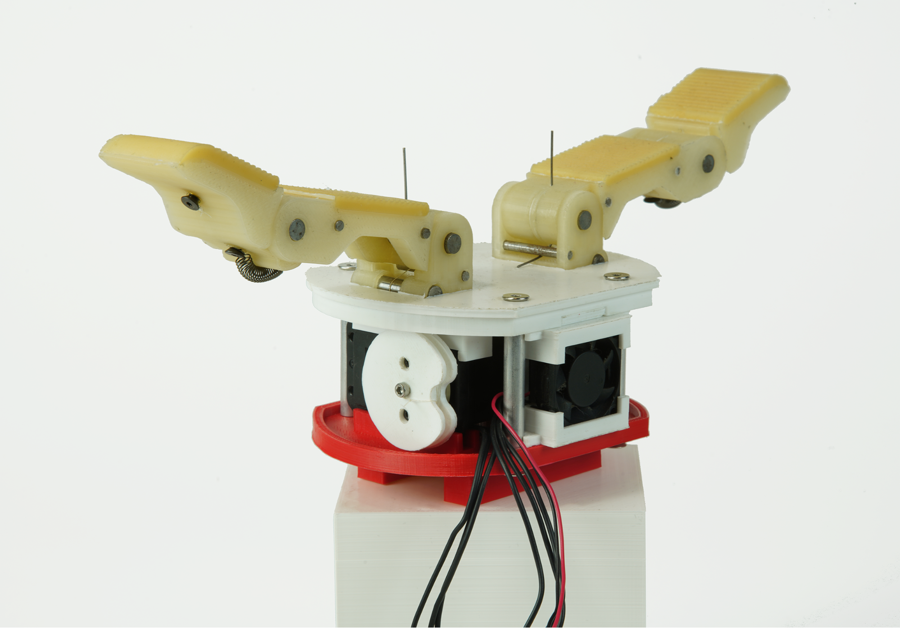

## Sentient Collaborative Robotics // Scanning & Glazing
---

Collaborative robotics over the next few years will without a doubt become a game changer for the entire fabrication and construction industry. Greater mechanization will enable manual labor to be minimized, as a means of achieving greater efficiencies and cost savings. We are in a crucial period of transition for architecture and design. The ITL/MAG is helping to cultivate a healthier discourse on the subject and to ensure their position in the field by concentrating technological efforts towards high-quality design and fabrication rather than just solely on operational productivity.

The research highlights such critical questions as: How can robotics expand on the variety of production and design options by increasing the potential for more significant material differentiation, performance, and complexity of form? What are the possibilities for applying robotics across a large scale of disciplines? What happens when one transfers the hand of the master into new tools and material practices by developing agency through awareness?

Robotics in the creative disciplines has the potential to recast the entire field as a practice: the modern division between intellectual work and manual production, between design and realization, is being rendered obsolete. What is apparent, though, is that it is only through informed speculation, research, and experimentation that architects, designers, and artists will ever have the hope of being significant players at the table when the cost, time and space of making has collapsed.

<iframe width="640" height="480" src="https://sketchfab.com/models/338f5aa603b24ec6b9303596867e3285/embed?autostart=1" frameborder="0" allow="autoplay; fullscreen; vr" mozallowfullscreen="true" webkitallowfullscreen="true"></iframe>

> We use virtual models of our machines as teaching tools.

> Custom robot controls for visual programming and ease of use.

---

### Touch

> Smart Hard Gripper: Pressure sensitive feedback system that can be calibrated to understand how much force it is generating on an object.

> Smart Hard Gripper V002

> Soft Pneumatic Gripper: Oven cooked for 10 min @ 150 deg. Cast using two rubber materials that have different degrees of flexibility into a 3d printed mold and then inflating it.

 

> Two Cup Pneumatic Pick & Place (2.26796185 kg)

 

> Solenoid Relay Control for UR10

 

> Robotic Spray Line Testing

 

> Robotic Spray Line Testing

<iframe width="640" height="480" src="https://sketchfab.com/models/0317b91add2a487d918dceb157c16a37/embed?autostart=1" frameborder="0" allow="autoplay; fullscreen; vr" mozallowfullscreen="true" webkitallowfullscreen="true"></iframe>

> 3D Model of our 4-Color Robotic Spray End Effector

---

### Vision

"Robot vision is to enable robots to perceive the external world in order to perform a large range of tasks such as navigation, visual surveying for object tracking and manipulation, object recognition and categorization, surveillance, and higher-level decision-making. Among different perceptual modalities, vision is arguably the most important one. It is, therefore, an essential building block of a cognitive robot." - Ales Ude -Jožef Stefan Institute, Slovenia

 

> Robotic Cinematography: point tracking @ 10’

 

> Robotic Cinematography: point tracking @ 2’

 

> Multi-Camera Robotic End Effector : thermal vision + 3d scanning + cell camera

 

> Custom Stereo Robotic Camera Rig

 

  

  
  

  

  
  

 

> Real-time Robotic Vision & Thermal Imaging

---

### Learning

Training our own AI to identify specific people, body movements and types of objects.

 

> Facial Recognition Training

 

> Image Recognition + Augmented Reality Mapping 

   

