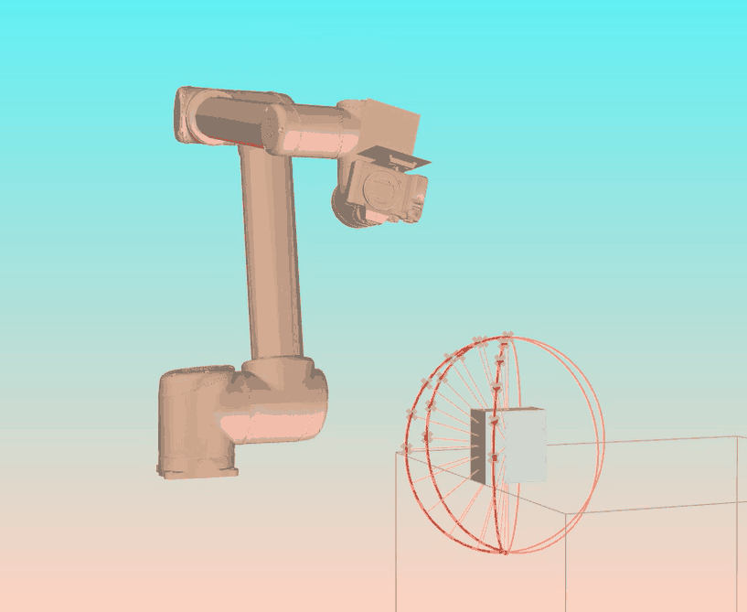

## Sentient Collaborative Robotics // Scanning & Glazing
---

Collaborative robotics over the next few years will without a doubt become a game changer for the entire fabrication and construction industry. Greater mechanization will enable manual labor to be minimized, as a means of achieving greater efficiencies and cost savings. We are in a crucial period of transition for architecture and design. The ITL/MAG is helping to cultivate a healthier discourse on the subject and to ensure their position in the field by concentrating technological efforts towards high-quality design and fabrication rather than just solely on operational productivity.

 

  

  
  

  

  
  

 

> Simulation of spray and camera tracking heads for the UR-10 robot

The research highlights such critical questions as: How can robotics expand on the variety of production and design options by increasing the potential for more significant material differentiation, performance, and complexity of form? What are the possibilities for applying robotics across a large scale of disciplines? What happens when one transfers the hand of the master into new tools and material practices by developing agency through awareness?

Robotics in the creative disciplines has the potential to recast the entire field as a practice: the modern division between intellectual work and manual production, between design and realization, is being rendered obsolete. What is apparent, though, is that it is only through informed speculation, research, and experimentation that architects, designers, and artists will ever have the hope of being significant players at the table when the cost, time and space of making has collapsed.

> Custom robot controls for visual programming and ease of use.

---

### Touch

> Smart Hard Gripper: Pressure sensitive feedback system that can be calibrated to understand how much force it is generating on an object.

> Soft Pneumatic Gripper: Oven cooked for 10 min @ 150 deg. Cast using two rubber materials that have different degrees of flexibility into a 3d printed mold and then inflating it. 

 

> Robotic Cinematography: point tracking @ 10’

---

   

