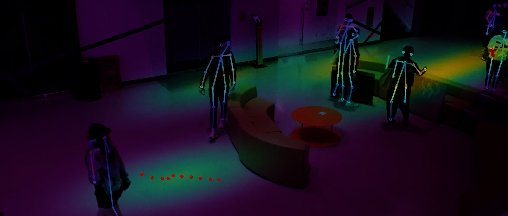

## Spatial Analysis & Simulation // ML & Sensors
---

The primary focus of this research is *spatial prospecting - to collect, analyze, and mine spatial data* to reveal human macro and micro structures hidden deep in our spatial and temporal dimensions. We are developing novel ways to combine machine learning, computer vision, photogrammetry, IoT devices, industrial design, architecture, and urban design, to allow us to gain insights into the relationship between space, design, and human behavior. There are several research areas that are currently undertaken by MAG under this topic., each with its own subset of challenges and goals. 

We have categorized our research areas into two domains: Public and Private. Public space analytics prioritizes itself with gathering anonymous spatial data in both urban and indoor environments, so we can gain insight into how design can facilitate social interactions. Private space analytics, on the other hand, is predicated on the use of data to help facilitate planning and management.   

------

### Spatial Analytics with Machine Learning

This research proposes a fully automated, autonomous, and anonymous approach to spatial and behavioral tracking using uncalibrated and unordered video footage and Building Information Models. The proposed technology allows us to utilize video recordings from most existing security camera systems and extract information on how people interact with objects in space, and their tendencies to congregate in certain areas. The spatial and behavioral tracking and analysis uses state of the art machine learning algorithm in human detection to produce a 3-dimensional point cloud dataset which can then be visualized as a heatmap for understanding activity concentrations. 

We also extract data for body gestures and how people interact with objects such as urban furniture, sculptures, lawn, trees, and other types of urban objects.  The system targets the archaic practice in urban design and architecture where spatial usage pattern data is collected with a survey by hand and on foot, which leads to highly inaccurate, unintelligibly biased, and practically useless results.  

<iframe width="100%" height="400" src="https://www.youtube.com/embed/ZnPfhx3L0Lg?rel=0;&autoplay=0&mute=1&controls=0&modestbranding=1" frameborder="0" allow="accelerometer; autoplay; encrypted-media; gyroscope; picture-in-picture" allowfullscreen></iframe>  

<iframe width="100%" height="400" src="https://www.youtube.com/embed/5BlZhzHAnjA?rel=0;&autoplay=0&mute=1&controls=0&modestbranding=1" frameborder="0" allow="accelerometer; autoplay; encrypted-media; gyroscope; picture-in-picture" allowfullscreen></iframe>

------

### Space Occupancy Tracking 

This research proposes an automated space occupancy tracking system to correlate spatial and behavioral analytics to environmental data via a network of Internet of Things (IoT) devices. The research  addresses one of the fundamental issues of any facilities which is how to enhance people's emotional and  physical productivity while effectively maximizing spatial occupancy with adequate infrastructure. The system uses machine learning human detection to collect anonymous spatial and behavioral data, custom trained machine learning object detection algorithm for furniture location and orientation detection, an Internet of Things sensor network for environmental data collection to gather temperature, humidity, light level, air quality, and lastly, a stereo camera with structure from motion algorithm for near realtime 3-dimensional point-cloud generation.

Below is a video showing test results of our custom trained machine learning tags. The tags will be deployed on furnitures and this setup will allow us to track location and orientation of the furnishings, as well as how people interact with them.

<iframe width="100%" height="400" src="https://www.youtube.com/embed/OEQaDA0RMyA?rel=0;&autoplay=0&mute=1&controls=0&modestbranding=1" frameborder="0" allow="accelerometer; autoplay; encrypted-media; gyroscope; picture-in-picture" allowfullscreen></iframe>

------

### Sensor Modules Design

One of our main goals is to pursue this as an interdisciplinary research and involve as many research assisants from different disciplines as possible. For our sensor network, the immediate design challenge is to develop a proper housing that can facilitate air flow and heat dissipation, battery and port access, and last but not least, mounting and structural issues, all the while keeping the design as compact and portable as possible.

An example design of our sensor network modules, designed and prototyped by our research assistant from the Industrial Design Department.

 

  

    
Machine Learning Computer Vision

  

  

    
Environmental Sensor Pack

  

  

    
Stereo SLAM Realtime 3D Capture
 
  

  

  
<iframe width="100%" height="300" src="https://sketchfab.com/models/6aabfe262db34c9bbdc76283030bc309/embed?autostart=1" frameborder="0" allow="autoplay; fullscreen; vr" mozallowfullscreen="true" webkitallowfullscreen="true"></iframe>

  

  

  
<iframe width="100%" height="300" src="https://sketchfab.com/models/25c09bfb59fe45f8b20d7cc35b357f5c/embed?autostart=1" frameborder="0" allow="autoplay; fullscreen; vr" mozallowfullscreen="true" webkitallowfullscreen="true"></iframe>

  
<iframe width="100%" height="300" src="https://sketchfab.com/models/60d659e402dc48a8a67a7fb72cf541c6/embed?autostart=1" frameborder="0" allow="autoplay; fullscreen; vr" mozallowfullscreen="true" webkitallowfullscreen="true"></iframe>

------

### Structure from Motion Photogrammetry

Below is an example of a 3D scan with SfM camera setup. Our approach is to combine high resolution data used to capture "Hard Elements" such as the locations of high wired infrastructure, building structure, and equipment. These are the static objects that do not or cannot be changed.  This high resolution scan can be used in conjunction with low-resolution real-time 3D scanning technology such as SLAM (see below) to assess the "Soft Elements" such as the presence and location of objects, furnitures, or anything else that maybe out-of-place.

This space is our ITL office in Brooklyn. Annotations in the model show the location of the sensors currently setup in our space. And the graphs below show the reading of our sensors. 

<iframe width="100%" height="400" src="https://sketchfab.com/models/cf230a87371c4df18d9ab2301bd7e731/embed" frameborder="0" allow="autoplay; fullscreen; vr" mozallowfullscreen="true" webkitallowfullscreen="true"></iframe>

------

### Data Visualization

We are also developing a dashboard system that can display all the relevant data gathered from the sensor network, machine learning spatial and behavioral tracking data, along with the 3D and 2D information. This allows us to run analytics and assessments to quantify all of these values as a comprehensive dataset. 

Room Occupancy Map

<iframe width="100%" height="400" frameborder="0" scrolling="no" src="//plot.ly/~prattitl/44.embed">ggg</iframe>

  

  <iframe width="100%" height="400" frameborder="0" scrolling="no" src="//plot.ly/~prattitl/168.embed"></iframe>
  

  

  <iframe width="100%" height="400" frameborder="0" scrolling="no" src="//plot.ly/~prattitl/170.embed"></iframe>
  

------

### Stereo Simultaneous Localization and Mapping Tests

We are conducting tests using stereocamera setup to generate realtime 3D scans. A stereocamera is mounted onto a robotic arm to sweep in a controlled and pre-defined path.  

<iframe width="100%" height="400" src="https://www.youtube.com/embed/HEfql1s4Qac?rel=0;&autoplay=0&mute=1&controls=0&modestbranding=1" frameborder="0" allow="accelerometer; autoplay; encrypted-media; gyroscope; picture-in-picture" allowfullscreen></iframe>

Mock up of a low resolution SLAM model, which can be used to assess soft elements such as any objects that are occupying the room that are not hard wired to the building. 

<iframe width="100%" height="400" src="https://sketchfab.com/models/f4564279025c427f9112eff864cf9e2c/embed" frameborder="0" allow="autoplay; fullscreen; vr" mozallowfullscreen="true" webkitallowfullscreen="true"></iframe>

---

